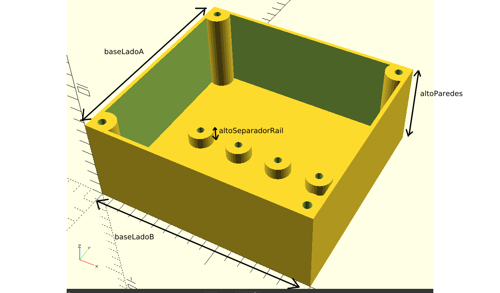

# Electric box

Made with OpenScad.

This is a design to create boxes to use electrial things for EDUCATIONAL purposes. You can change the dimensions and more. As you can see in the images, there are some basic variables. The other ones are for more special things, default values works well.

To change between designs, change the number in varible "objetoParaMostrar".

I used threaded rod M5.

DISCLAIMER: Electricity is a serious thing, do not create or use that box if you do not have some experience with cables, voltages and that type of stuff. Seriously, you can die. This box has NO IP and IK ratings, of course.

